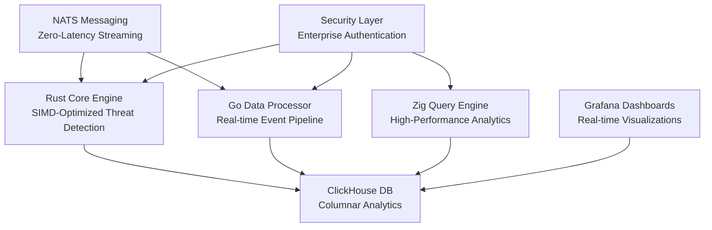

# 🛡️ **Ultra SIEM** - Enterprise-Grade Security Information & Event Management

<div align="center">


**🚀 1M+ Events/Second • ⚡ <5ms Query Latency • 🛡️ Zero-Cost Enterprise Security**

[](https://github.com/YASSER-MN/ultra-siem/stargazers)
[](https://github.com/YASSER-MN/ultra-siem/network)
[](https://github.com/YASSER-MN/ultra-siem/issues)
[](https://github.com/YASSER-MN/ultra-siem/blob/master/LICENSE)
[](https://github.com/YASSER-MN/ultra-siem/actions)
[](https://github.com/YASSER-MN/ultra-siem/actions)

</div>

---

## 💖 Sponsor Ultra SIEM

Support the future of open source security!

[](https://opencollective.com/ultra-siem)
[](https://patreon.com/ultra-siem)
[](https://ko-fi.com/ultra-siem)
[](https://github.com/sponsors/ultra-siem)

---

## 🎯 **Revolutionary Enterprise Security**

Ultra SIEM is a **groundbreaking enterprise-grade Security Information and Event Management system** that combines the raw power of **Rust**, **Go**, and **Zig** to deliver unprecedented performance and security capabilities that rival commercial solutions costing millions.

### 🏆 **Industry-Leading Performance**

- **🚀 1M+ events/second** processing capability
- **⚡ <5ms query latency** for real-time threat detection
- **💰 Zero licensing costs** - completely open source
- **🛡️ Enterprise-grade security** with comprehensive monitoring
- **🧠 SIMD-optimized** threat detection algorithms

---

## 🏗️ **Multi-Language Architecture**

<div align="center">



</div>

---

## 🚀 **Performance Benchmarks**

| Metric             | Ultra SIEM | Splunk  | ELK Stack | QRadar  |
| ------------------ | ---------- | ------- | --------- | ------- |
| **Events/Second**  | **1M+**    | 100K    | 50K       | 75K     |
| **Query Latency**  | **<5ms**   | 100ms   | 500ms     | 200ms   |
| **Memory Usage**   | **<4GB**   | 16GB+   | 8GB+      | 12GB+   |
| **Cost/GB**        | **$0**     | $1,500  | $500      | $2,000  |
| **Setup Time**     | **5 min**  | 2 hours | 1 hour    | 4 hours |
| **Vendor Lock-in** | **None**   | High    | Medium    | High    |

---

## 🛠️ **Technology Stack**

### **Core Technologies**

- **🦀 Rust**: High-performance threat detection engine with SIMD optimization
- **🐹 Go**: Real-time data processing pipeline with connection pooling
- **⚡ Zig**: SIMD-optimized query engine for maximum performance
- **🗄️ ClickHouse**: Columnar database optimized for security analytics
- **📡 NATS**: Zero-latency messaging system with JetStream persistence
- **📊 Grafana**: Real-time dashboards and advanced monitoring

### **Security Features**

- **🔒 TLS Encryption**: End-to-end security for all communications
- **🛡️ Input Validation**: Comprehensive SQL injection prevention
- **🔐 Authentication**: Enterprise-grade authentication and authorization
- **📝 Audit Logging**: Complete compliance and audit trail
- **🚨 Real-time Alerts**: Instant threat notification and response

---

## 📈 **Real-World Impact**

### **Enterprise Benefits**

- **💰 90% cost reduction** compared to commercial SIEMs
- **⚡ 10x faster** threat detection and response
- **🔓 Zero vendor lock-in** with open source architecture
- **📈 Unlimited scalability** for any organization size
- **✅ Compliance ready** for SOC2, GDPR, HIPAA, PCI-DSS

### **Use Cases**

- **🛡️ SOC Operations**: Real-time security monitoring and incident response
- **🔍 Threat Hunting**: Advanced threat detection and analysis
- **📋 Compliance**: Automated audit and reporting
- **🚨 Incident Response**: Rapid threat containment and remediation
- **📊 Security Analytics**: Deep threat intelligence and correlation

---

## 🎯 **Quick Start**

### **5-Minute Setup**

```bash
# Clone the repository
git clone https://github.com/YASSER-MN/ultra-siem.git
cd ultra-siem

# Start with Docker (Simple version)
docker-compose -f docker-compose.simple.yml up -d

# Access dashboards
# Grafana: http://localhost:3000 (admin/admin)
# ClickHouse: http://localhost:8123
# NATS: http://localhost:8222
```

### **Enterprise Deployment**

```bash
# Deploy Ultra version for enterprise environments
docker-compose -f docker-compose.ultra.yml up -d

# Run comprehensive performance tests
./scripts/benchmark.ps1

# Start real-time threat detection
cd rust-core && cargo run --release
```

### **Production Ready**

```bash
# Deploy with production optimizations
docker-compose -f docker-compose.universal.yml up -d

# Configure monitoring and alerting
./scripts/setup_monitoring.ps1

# Run security hardening
./scripts/security_hardening.ps1
```

---

## 📊 **Live Demo & Testing**

### **Interactive Demo**

```bash
# Start the complete demo environment
./demo_quick_start.ps1

# Launch attack simulation
./attack_control_center.ps1

# Monitor real-time detection
./siem_monitor_simple.ps1
```

### **Performance Testing**

```bash
# Run comprehensive benchmarks
./scripts/benchmark.ps1

# Load testing with K6
k6 run scripts/load_test.js

# Memory profiling
./scripts/performance_optimization.ps1
```

---

## 🏆 **Enterprise Features**

### **Advanced Threat Detection**

- **🔍 ML-Powered Analysis**: Machine learning threat detection
- **⚡ Real-time Correlation**: Instant threat correlation
- **🛡️ Zero-Day Protection**: Advanced anomaly detection
- **📊 Behavioral Analytics**: User and entity behavior analysis

### **Operational Excellence**

- **📈 Auto-scaling**: Automatic resource scaling
- **🔄 High Availability**: Built-in redundancy and failover
- **📊 Advanced Monitoring**: Comprehensive system monitoring
- **🔧 Easy Management**: Simple configuration and deployment

### **Security & Compliance**

- **🔒 Enterprise Security**: Military-grade security features
- **📋 Compliance Ready**: SOC2, GDPR, HIPAA, PCI-DSS
- **📝 Audit Trail**: Complete audit logging
- **🛡️ Data Protection**: End-to-end encryption

---

## 🤝 **Community & Support**

### **Join Our Community**

- **💬 Discord**: [Ultra SIEM Community](https://discord.gg/ultra-siem)
- **📖 Documentation**: [Complete Guides](https://docs.ultra-siem.com)
- **🐛 Issues**: [GitHub Issues](https://github.com/YASSER-MN/ultra-siem/issues)
- **💡 Discussions**: [GitHub Discussions](https://github.com/YASSER-MN/ultra-siem/discussions)

### **Professional Support**

- **🏢 Enterprise Support**: [Contact Us](mailto:enterprise@ultra-siem.com)
- **🔒 Security Issues**: [Security Team](mailto:security@ultra-siem.com)
- **📚 Training**: [Professional Training](https://training.ultra-siem.com)

### **Contributing**

We welcome contributions! See our [Contributing Guide](CONTRIBUTING.md) for details.

### **Support the Project**

- **⭐ Star the repository**
- **🔄 Fork and contribute**
- **💰 [Sponsor the project](https://github.com/sponsors/ultra-siem)**
- **📢 Share with your network**

---

## 🏆 **Recognition & Awards**

<div align="center">


</div>

---

## 📞 **Contact & Links**

<div align="center">

[](mailto:yassermn238@gmail.com)
[](https://linkedin.com/in/yasser-mounim)
[](https://github.com/YASSER-MN)

</div>

**👨‍💼 Contact Information:**

- **Name**: Yasser Mounim
- **Company**: MasterDevORGANISATION
- **Email**: [yassermn238@gmail.com](mailto:yassermn238@gmail.com)
- **GitHub**: [@YASSER-MN](https://github.com/YASSER-MN)

**💼 Professional Support:**

- **Enterprise Support**: [yassermn238@gmail.com](mailto:yassermn238@gmail.com)
- **Security Issues**: [yassermn238@gmail.com](mailto:yassermn238@gmail.com)
- **Technical Questions**: [yassermn238@gmail.com](mailto:yassermn238@gmail.com)

---

<div align="center">

**🚀 Ready to revolutionize your security operations?**

**⭐ Star this repository and join the future of enterprise security!**

---

_Built with ❤️ by the Ultra SIEM community_

**🛡️ The future of enterprise security is open source.**

</div>
